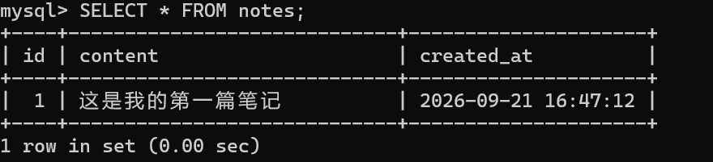

# 9.21  

## MySQL的安装

在wsl下载了MySQL并第一次使用  

  

## 问题回答  

### 1：MySQL 是像 Excel 那样以表格形式存储数据的. 但是它可以轻轻松松承载什么数量级的数据?  

千万行级别的数据  

### 2：MySQL 是怎么做到能轻松承载大量数据, 并且查询, 修改它们时仍然很快的?  

通过索引和B+树，使查询复杂度从 n 降低到log n 次，极大的加快了查询效率  

### 3：如何使用你所选择的编程语言来通过代码操作 MySQL?  

Java语言通过JDBC工具来操作MySQL  

# 10.5

## MySQL的增删改查

### 1：增删改查语句

增 INSERT INTO、删 DELETE FROM、改 UPDATE ... SET、查 SELECT ... FROM ... 。  

### 2：如何用接口进行增删改查

SQL 的四个动词对应 HTTP 的四个方法：POST 新增 / GET 查询 / PUT 修改 / DELETE 删除，路径都是 /notes（如http://localhost:8080/notes 查询、修改、删除再带上 id）。

### 3：注意事项  

终端进入 mysql 后先选择操作哪个库在进行操作  

UPDATE 和 DELETE 使用时应加上 WHERE 防止对无关数据造成影响（应在使用这俩者之前先 SELECT 查看要修改删除的数据是否正确）  